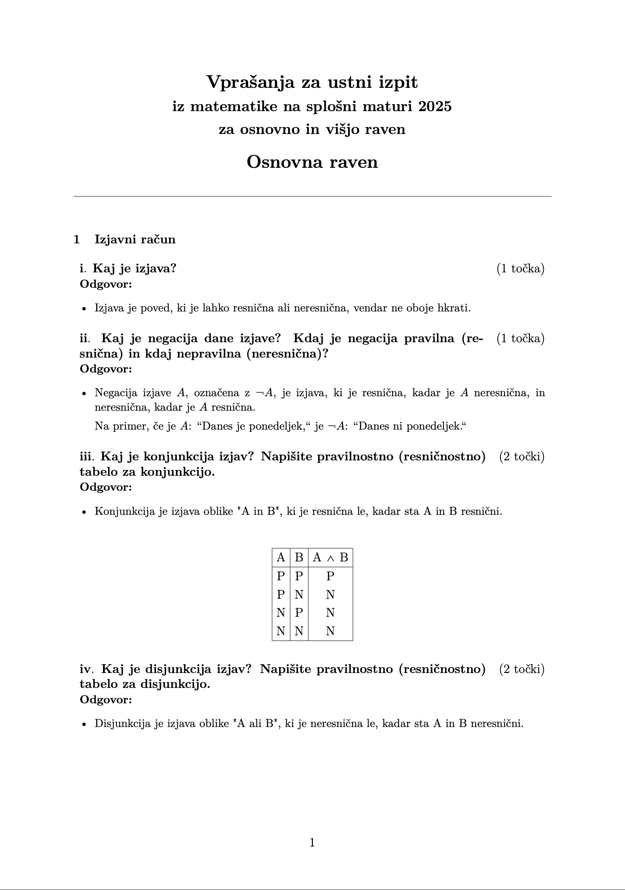

# MATURA
Rešitve in razlage za vprašanja ustnega dela maturitetnega izpita iz matematike (osnovni nivo).

Če v dokumentu opazite kakšno napako, bodisi matematično, slovnično ali jezikovno, mi prosim pišite na `jbalkovec@seattleu.edu`. Z veseljem popravim vse napake 🙂

**Odgovori:** [questions.pdf](questions.pdf)

